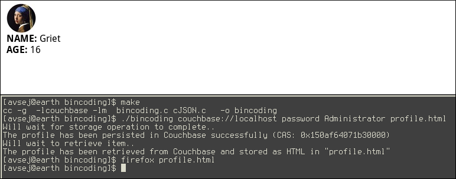

This example demonstrates how to write custom transcoders for structs in C.

Here we store user profile with embedded avatar as document in Couchbase, and retrieve it back to render as HTML.
Note, that encoding of the `struct Profile` remains friendly to Couchbase indexers, and data could be retrieven using any of queries (N1QL, FTS etc).

To try the example, use Makefile to build the binary and then execute it:

    $ make
    $ ./bincoding couchbase://localhost password Administrator profile.html

The rendered HTML should look like this

